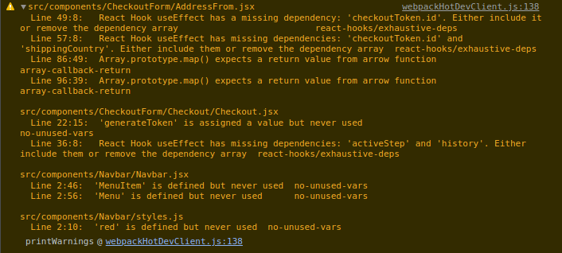

***
# Project Status Report #7
***

## Group 1

### 1. Linked issues

- [checkout-form](https://github.com/sudo-eddy/ecommerce-group-fall-21/issues/13)
- [beautify](https://github.com/sudo-eddy/ecommerce-group-fall-21/issues/15)

***

### 2. Participation

- [x] Pradeep
- [x] Eddy
- [ ] Jorel

#### Ticket status

##### - [checkout-form](https://github.com/sudo-eddy/ecommerce-group-fall-21/issues/13)

- [x] In-progress
- [ ] Completed
- [ ] Backlog
- [ ] Blocked
- **Notes:** Implemented the Address form, however I am not seeing it in the screen and getting a dependency error which I cannot find. Currently in debugging mode

- 

##### - [beautify](https://github.com/sudo-eddy/ecommerce-group-fall-21/issues/15)

- [x] In-progress
- [ ] Completed
- [ ] Backlog
- [ ] Blocked
- **Notes:** Pradeep working on logo

***

### 3. Blockers

- little input from team
- Address form is not rendering as expected
